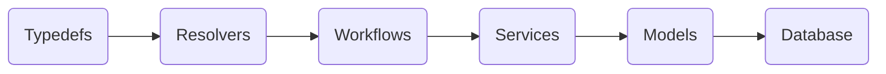

# Unlimitd API

[](https://www.javascript.com)

### Technical overview

- [Apollo Server](https://www.apollographql.com/docs/apollo-server/) ([GraphQL](https://graphql.org/)) with the [Express](https://expressjs.com/) Web framework.
- [NPM](https://www.npmjs.com/) manages dependencies.
- [Knex.js](https://knexjs.org/) handles SQL queries to the [PostgreSQL](https://www.postgresql.org/) database and [Objection.js](https://vincit.github.io/objection.js/) is used as an [ORM](https://en.wikipedia.org/wiki/Object-relational_mapping).
- [Config](https://github.com/lorenwest/node-config) package manages env variables (Development, Staging & Production)

### Global architecture



### Typesdefs

> **Note:** You can find all typesdefs here: **src/graphql/*/typeDefs.graphql**

Typedefs are a kind of `interface` taking signatures of all query, mutation, type, input and enum

### Resolvers

> **Note:** You can find all resolvers here: **src/graphql/*/resolvers.js**

All operations defined in `typedefs` are resolved by resolvers. Their role is to attach logical processing to each operation.

In our paradigm, a resolver always calls a `worflow` by passing it the parameters it needs.


It is possible to secure the accessibility to certain operations by using the `combineResolvers` function, which allows resolvers to be chained together for role and state checks.


### Workflows

> **Note:** You can find all the workflows here: **src/workflows**

Workflows encapsulate all operations related to a business process using services. They are written as a `class` with `static methods`.


### Services

> **Note:** All workflows can be found here: **src/services**

Services are responsible for defining functions that `interact with the database` using the `Knex ORM`. They are written as a `class` with `static methods`.


### Running the project locally

1. Make sure you're using `NodeJS v16`.
2. Install [Docker](https://www.docker.com/) and [Docker-compose](https://docs.docker.com/compose/).
3. Run in your terminal `make init` to initialize the project

### Initial users

##### [ADMIN]
- Username: `admin@demo.com`
- Password: `password`

##### [USER]
- Username: `user@demo.com`
- Password: `password`

### Recommended development environment

It is recommended to use [vscode](https://code.visualstudio.com/download) with the following extensions:

1. [ESLint](https://marketplace.visualstudio.com/items?itemName=dbaeumer.vscode-eslint)
2. [Prettier](https://marketplace.visualstudio.com/items?itemName=esbenp.prettier-vscode)
3. [Spell Checker](https://marketplace.visualstudio.com/items?itemName=streetsidesoftware.code-spell-checker)

The project embeds this [vscode](https://code.visualstudio.com/download) configuration :

```json
{
  "editor.codeActionsOnSave": {
    "source.fixAll.eslint": true
  },
  "editor.formatOnSave": true,
  "eslint.validate": ["javascript"]
}
```

1. Enable json eslint validation.
2. Auto fix eslint plugins rules on save.